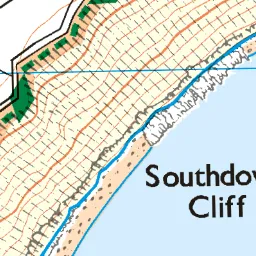

# OS Maps app tools
Extracting and converting maps from the OS Maps app.

|  |
| :---: |
| Free the maps you've bought from the OS Maps app |

## Summary
* Paper Ordnance Survey maps come with a code that allows you to add the map to your OS Account.
* In the [OS Maps app](https://shop.ordnancesurvey.co.uk/apps/os-maps-subscriptions/#app) you can download these maps without the need for a subscription.
* This tool allows you to extract these maps from the OS Maps app and work with them in MBTiles format.
* This allows you to use the digital OS Maps that you've bought with other mapping apps (such as [AlpineQuest](https://alpinequest.net/en/help/v2/maps/file-based-select), [Backcountry Navigator](https://www.backcountrynavigator.com/backcountry-navigator-pro), [Cartograph Maps](https://www.cartograph.eu/v3/), [Locus Map](https://www.locusmap.app/), [etc.](https://www.cumbriasoaringclub.co.uk/kb/osm.php#apps)).

## :warning: Disclaimer
The tools and techniques described here should only be used in accordance with the Ordance Survey terms of use and UK law. Be aware that these terms of service may explicitly prohibit the extraction of maps from the app. Don't do anything illegal with the knowledge you learn here; if you do that's entirely your fault.

Please don't share any OS Maps - purchasing their excellent maps funds the work put into making them.

## Directions for use
Run with the `--help` flag for the command line help text:

```powershell
python ostools.py --help
usage: ostools.py [-h] [-verbose] command ...

Tools for working with maps from the OS Maps app.

positional arguments:
  command
    extract   Extract maps from mbgl-offline.db
    convert   Convert MBTiles files from png to webp

optional arguments:
  -h, --help  show this help message and exit
  -verbose    run in verbose mode
```

### Requirements
You should not need to install additional packages to `extract`, but the `convert` command requires [Pillow](https://pillow.readthedocs.io/en/stable/installation.html) and other undocumented commands require [requests](https://requests.readthedocs.io/en/latest/user/install/#install). You should be able to use the `requirements.txt` file to install these; i.e. `pip install -r ./requirements.txt`.

### Extracting maps (`extract`)
_You'll need a rooted device to `extract`. If you don't have a rooted physical device then you can use the emulator built into the Android Studio SDK with a rooted virtual device._

1. Within the OS Maps app, [download the maps](https://osmaps.com/os-maps-help?categoryId=631349&article=637593#article-id-637593) that you want to extract
1. Copy `/data/data/uk.co.ordnancesurvey.osmaps/files/mbgl-offline.db` from the device to your computer
1. Run `python ostools.py extract`

Each region downloaded in the OS Maps app will be extracted into its own `.mbtiles` file.

You can adjust the extraction process using the `-file`, `-regions`, and `-zoom` flags:

```powershell
> python ostools.py extract --help
usage: ostools.py extract [-h] [-file FILE] [-regions [REGIONS [REGIONS ...]]] [-zoom ZOOM]

optional arguments:
  -h, --help            show this help message and exit
  -file FILE            path to OS Maps database (default: './mbgl-offline.db')
  -regions [REGIONS [REGIONS ...]]
                        regions to extract from the database
  -zoom ZOOM            MBTiles tile zoom level (default: 16)
```

### Converting maps (`convert`)
Once you have your maps in MBTiles format you may wish to convert the tiles from PNG to WEBP format to reduce the file size without significantly impacting quality:

1. Run `python ostools.py convert {filename}`

A new file, `{filename}_webp.mbtiles`, will be created in which the tile image format is WEBP.

You can adjust the WEBP compression parameters in order to obtain your desired balance of image quality and size:

```powershell
> python ostools.py convert --help
usage: ostools.py convert [-h] [-quality [QUALITY]] file

positional arguments:
  file                path to MBTiles file

optional arguments:
  -h, --help          show this help message and exit
  -quality [QUALITY]  quality of WEBP compression (0-100, default: 50)
```

Reference the [Pillow documentation](https://pillow.readthedocs.io/en/stable/handbook/image-file-formats.html#webp) for an explanation of how the `-quality` parameter behaves. This is an illustration of the compression performance on a single map tile:

| PNG | WEBP (100) | WEBP (75) | WEBP (50) _default_ | WEBP (25) | WEBP (0) |
| :---: | :---: | :---: | :---: | :---: | :---: |
| 26,912 bytes | 23,668 bytes | 16,726 bytes | 14,476 bytes | 8,820 bytes | 2,362 bytes |
|  |  |  |  |  |  |

### Other commands
Other undocumented commands are unsupported and should not be used.

## Example usage
A simple example of extracting and converting a map from the OS Maps app database:

```powershell
> python .\ostools.py -verbose extract
    Loading OS Maps database './mbgl-offline.db': Done
    Identifying regions: Explorer OL44
    Creating outfile 'Explorer OL44.mbtiles': Done
    Preparing MBTiles structure: Done
    Decompressing and copying map tiles: Done
    Extract completed.

> python .\ostools.py -verbose convert 'Explorer OL44.mbtiles'
    Loading MBTiles file 'Explorer OL44.mbtiles': Done
    Creating outfile 'Explorer OL44_webp.mbtiles': Done
    Preparing MBTiles structure: Done
    Converting tiles to WEBP (be patient!): Done
    Convert completed.

> ls *.mbtiles
    Directory: .\OS-Maps-app-tools
    Mode             LastWriteTime         Length Name
    ----             -------------         ------ ----
    -a----       00/00/0000  00:00       72069120 Explorer OL44.mbtiles
    -a----       00/00/0000  00:00       50507776 Explorer OL44_webp.mbtiles
```

Note the difference in file size once the map tiles are converted from `PNG` to `WEBP` formats.