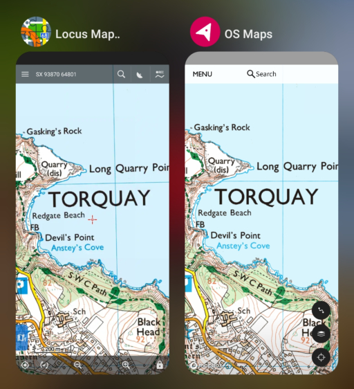

# OS Maps app tools
Extracting and converting maps from the OS Maps app.

|  |
| :---: |
| Free the maps you've bought from the OS Maps app |

## Summary
* Paper Ordnance Survey maps come with a code that allow you to add the maps you've bought to your OS Account.
* In the [OS Maps app](https://shop.ordnancesurvey.co.uk/apps/os-maps-subscriptions/#app) you can download the maps in your account without the need for a subscription.
* This repository contains tools that facilitate extracting maps from the OS Maps app in MBTiles format and converting the tiles from the default `.png` to the more space efficient `.webp`.
* This allows you to use the digital OS Maps that you've bought with other mapping apps (such as [AlpineQuest](https://alpinequest.net/en/help/v2/maps/file-based-select), [Backcountry Navigator](https://www.backcountrynavigator.com/backcountry-navigator-pro), [Cartograph Maps](https://www.cartograph.eu/v3/), [Locus Map](https://www.locusmap.app/), [etc.](https://www.cumbriasoaringclub.co.uk/kb/osm.php#apps)).

## :warning: Disclaimer
The tools and techniques described here should only be used in accordance with the Ordance Survey terms of use and UK law. Be aware that these terms of service may explicitly prohibit the extraction of maps from the app. Don't do anything illegal with the knowledge you learn here; if you do that's entirely your fault.

Please don't share any OS Maps - purchasing their excellent maps funds the work put into making them.

## Directions for use
_You'll need a rooted device to extract maps from the OS App. If you don't have a physical rooted device then you can use the emulator built into the Android Studio SDK with a rooted virtual device._

### Requirements
You'll need to install [Pillow](https://pillow.readthedocs.io/en/stable/installation.html) and [requests](https://requests.readthedocs.io/en/latest/user/install/#install). You should be able to use the `requirements.txt` file for this; i.e. `pip install -r ./requirements.txt`.

### Extracting maps
Directions for extracting the maps downloaded in the OS Maps app to individual MBTiles files:

1. Within the OS Maps app, [download the maps](https://osmaps.com/os-maps-help?categoryId=631349&article=637593#article-id-637593) that you want to extract
1. Copy `/data/data/uk.co.ordnancesurvey.osmaps/files/mbgl-offline.db` to your computer
1. Run `extraction.py`

Each region downloaded in the OS Maps app will be extracted into its own `.mbtiles` file.

### Converting maps
Directions for converting the tiles within the extracted maps to webp format for more space efficient storage.

1. Run `conversion.py $filename`

A new file, `$filename_webp.mbtiles`, will be created in which the tile image format is webp.

This is by default a _lossy_ process so you may want to tweak the [hardcoded](https://github.com/aricooperdavis/OS-Maps-app-tools/blob/main/conversion.py#L42) [compression parameters](https://pillow.readthedocs.io/en/stable/handbook/image-file-formats.html#webp) to your quality/size preferences. This is an illustration of the default compression parameters:

| Original | Compressed |
| :---: | :---: |
| 26,912 bytes | 13,166 bytes |
|  |  |

## Example usage
A simple example of extracting and converting a map from the OS Maps app database. Note the difference in file size once the map tiles are converted from `png` to `webp` formats.

```powershell
> ls

    Directory: .\OS-Maps-app-tools

Mode                 LastWriteTime         Length Name
----                 -------------         ------ ----
-a----        00/00/0000     00:00           1679 conversion.py
-a----        00/00/0000     00:00           2351 extraction.py
-a----        00/00/0000     00:00     1069801472 mbgl-offline.db

> python .\extraction.py
> python .\conversion.py '.\Explorer OL44.mbtiles'
> ls

    Directory: .\OS-Maps-app-tools

Mode                 LastWriteTime         Length Name
----                 -------------         ------ ----
-a----        00/00/0000     00:00           1679 conversion.py
-a----        00/00/0000     00:00           2351 extraction.py
-a----        00/00/0000     00:00     1069801472 mbgl-offline.db
-a----        00/00/0000     00:00       72069120 Explorer OL44.mbtiles
-a----        00/00/0000     00:00       50507776 Explorer OL44_webp.mbtiles
```
